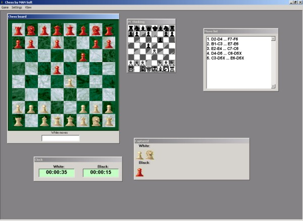



## Chess Engine \(lowlevel\) ver 2

### Description

This is Chess game with engine implemented as activeX DLL project. It also displays computer thinkings. It currently thinks 1 level deep, but it could be easily changed (recursive).

Since this project exists for 2 months, it is buggy (engine doesn't have idea about castling; user can castle, also piece promotion is not yet implemeted)and incomplete. I plan to port code (when it'll be ready) to C++.

U will have big problems reading this code. It is very complicated plus comments and variables names are not in english. But on request I can translate at least comments...

User cannot drag pieces; he must type moves instead (like e2e4)...

U can use this code freely!
 
### More Info
 

             |
---                |---
**Submitted On**   |2001-04-19 14:55:34
**By**             |[Marjan Mrak](https://github.com/Planet-Source-Code/PSCIndex/blob/master/ByAuthor/marjan-mrak.md)
**Level**          |Advanced
**User Rating**    |4.4 (31 globes from 7 users)
**Compatibility**  |VB 6\.0
**Category**       |[Games](https://github.com/Planet-Source-Code/PSCIndex/blob/master/ByCategory/games__1-38.md)
**World**          |[Visual Basic](https://github.com/Planet-Source-Code/PSCIndex/blob/master/ByWorld/visual-basic.md)
**Archive File**   |[Chess Engi185404192001\.zip](https://github.com/Planet-Source-Code/marjan-mrak-chess-engine-lowlevel-ver-2__1-22495/archive/master.zip)

